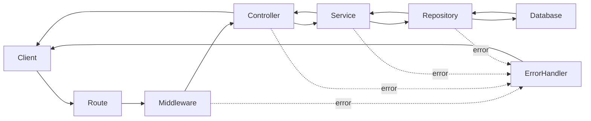

# Auction Marketplace API Contract and Flow Guide

This file documents the backend API mounted by `Backend/src/app.js`. It is written as a learning guide: every endpoint has its input, output, call chain, middleware path, error path, and review notes.

## 1. Architecture at a glance

### 1.1 Request path



- **Route** chooses the endpoint and composes middleware.
- **Middleware** authenticates, authorizes, validates, or loads a resource before the controller runs.
- **Controller** converts a successful service result into HTTP status and JSON. Controllers are intentionally thin.
- **Service** owns validation and business rules.
- **Repository** is the only normal layer that talks to Prisma/PostgreSQL.

### 1.2 Standard success and error shapes

Most successful responses use:

```json
{ "success": true, "message": "optional", "data": {} }
```

Most failed HTTP responses use:

```json
{
  "success": false,
  "message": "Human-readable explanation",
  "code": "MACHINE_READABLE_CODE",
  "errors": [{ "field": "optional", "message": "optional" }]
}
```

`PATCH /notifications/:notificationId/read` is the exception: it returns `204 No Content`.

### 1.3 How errors travel

1. A middleware, service, or repository throws `AppError(message, statusCode, code, details)`.
2. Controllers are wrapped by `asyncHandler`. Rejected promises become `next(error)`.
3. Express reaches `errors/errorHandler.js`, registered after all routes in `app.js`.
4. It maps known Prisma errors: `P2002` to `409`, `P2025` to `404`, and `P2003` to `400`.
5. Operational errors keep their intended status/code. Unexpected errors are logged and return `500 INTERNAL_SERVER_ERROR`; production hides the original message.

Auth middleware uses local `try/catch` because it must translate JWT-library failures into controlled `401` `AppError`s. Normal controllers do not need repetitive `try/catch` because `asyncHandler` handles them centrally.

### 1.4 Shared middleware meanings

| Middleware | What it does | Failure behavior |
| --- | --- | --- |
| `verifyAccessTokenMiddleware` | Reads access token from HTTP-only cookie or `Authorization` header, verifies it, attaches `req.user`. | `401` for missing, expired, or invalid token. |
| `extractRefreshTokenFromCookie` | Reads refresh token cookie and attaches `req.refreshToken`. | `401 REFRESH_TOKEN_INVALID` when absent/invalid. |
| `requireRole(role)` | Requires authenticated, active user with required account type. | `403` for inactive or wrong role. |
| `validateRequest(...)` | Checks specified body, parameter, or query fields. | `400 VALIDATION_ERROR`. |
| `loadOwnedResource(...)` | Loads a resource and verifies the authenticated user owns it. | `404`/`403`, depending on lookup/ownership result. |

## 2. Authentication APIs

Base path: `/api/v1/auth`

### 2.1 `POST /register`

- **Purpose:** Create a bidder or seller account and start a session.
- **Input:** JSON body: `email`, `password`, `full_name`, `display_name`, `account_type` (`BIDDER` or `SELLER`). Password must meet the service strength rules.
- **Output:** `201` with `data.user` containing `id`, `email`, `full_name`, `display_name`, and `account_type`. Sets HTTP-only `accessToken` and `refreshToken` cookies.
- **Function flow:** `registerUserController` -> `registerUserService` -> `createUser`, `storeRefreshToken`, `updateLastLogin` repository calls.
- **Middleware:** None; public route.
- **Error flow:** Validation/duplicate-email errors become `AppError`; duplicate Prisma value is normalized to `409 DUPLICATE_RESOURCE`; controller promise failures reach global `errorHandler` through `asyncHandler`.
- **Review notes:** Password hashing and token cookies are good. Add rate limiting and optionally email verification to reduce automated account creation.

### 2.2 `POST /login`

- **Purpose:** Verify credentials and create a session.
- **Input:** JSON body: `email`, `password`.
- **Output:** `200` with basic `data.user`; sets new access/refresh token cookies.
- **Function flow:** `loginUserController` -> `loginUserService` -> `findUserByEmail`, bcrypt comparison, `storeRefreshToken`, `updateLastLogin`.
- **Middleware:** None; public route.
- **Error flow:** Invalid credentials or inactive account are controlled service errors; unexpected repository/JWT errors flow through `asyncHandler` and global handler.
- **Review notes:** A generic credential failure is correct because it avoids confirming whether an email exists. Add rate limiting and a failed-login lockout/backoff policy.

### 2.3 `GET /me`

- **Purpose:** Return the currently authenticated user profile for frontend session restoration.
- **Input:** Access token cookie/header; no body.
- **Output:** `200`, `data.user` with profile fields including contact/account/KYC status and timestamps.
- **Function flow:** `getCurrentUserController` -> `getCurrentUserService` -> `findProfileById`.
- **Middleware:** `verifyAccessTokenMiddleware`.
- **Error flow:** Token errors stop before the controller with `401`; a missing/inactive user is handled by service/repository and reaches the global handler.
- **Review notes:** Correctly avoids trusting a stale frontend profile. This endpoint should remain authenticated.

### 2.4 `POST /refresh-token`

- **Purpose:** Issue a new access token without requiring credentials again.
- **Input:** `refreshToken` HTTP-only cookie.
- **Output:** `200`, basic `data.user`, and a replacement `accessToken` cookie.
- **Function flow:** `refreshAccessTokenController` -> `refreshAccessTokenService` -> `findRefreshTokenByHash`, `findUserById`; expired refresh tokens are deleted.
- **Middleware:** `extractRefreshTokenFromCookie`.
- **Error flow:** Missing cookie fails in middleware; hash/expiry/account checks fail in the service; all continue to the central error handler.
- **Review notes:** Refresh tokens are stored hashed, which is good. Consider refresh-token rotation and reuse detection; concurrent refresh requests can otherwise issue several valid access tokens.

### 2.5 `POST /logout`

- **Purpose:** End this session and revoke its persisted refresh token.
- **Input:** `refreshToken` HTTP-only cookie.
- **Output:** `200` success message; clears access and refresh cookies.
- **Function flow:** `logoutUserController` -> `logoutUserService` -> `deleteRefreshToken`.
- **Middleware:** `extractRefreshTokenFromCookie`.
- **Error flow:** Missing refresh cookie is a `401`; normal deletion and cookie clear succeed even when the token was already removed.
- **Review notes:** Good single-session revocation behavior. A later “log out all devices” endpoint could delete all token rows for a user.

## 3. Category APIs

Base path: `/api/v1/categories`

### 3.1 `POST /add`

- **Purpose:** Bulk-create categories.
- **Input:** JSON body: `categories`, an array of `{ name, slug, display_order, commission_rate, image_url? }`.
- **Output:** `201`, with the number successfully inserted.
- **Function flow:** `addCategoriesController` -> `addCategoriesService` -> `createCategories` using Prisma `createMany`/duplicate skipping.
- **Middleware:** None.
- **Error flow:** Service rejects malformed array/items with `400`; Prisma failures pass through controller `asyncHandler` to global handler.
- **Review notes:** **Important authorization weakness:** this route is public, so any caller can create categories. Add an authenticated administrator role before production. Image URLs are length-checked but not URL-validated.

### 3.2 `GET /`

- **Purpose:** List categories for browsing/product creation.
- **Input:** None.
- **Output:** `200`, `data.categories` with public fields: `id`, `name`, `slug`, `display_order`, `image_url`.
- **Function flow:** `getAllCategoriesController` -> `getAllCategoriesService` -> `getAllCategories`.
- **Middleware:** None.
- **Error flow:** Repository failures flow through `asyncHandler` and global handler.
- **Review notes:** Public, ordered, and cacheable. Commission rate is intentionally not exposed.

## 4. Product APIs

Base path: `/api/v1/products`

### 4.1 `POST /`

- **Purpose:** Create a product owned by the authenticated seller.
- **Input:** Required JSON fields: `title`, `category_id`, `condition`, `primary_image`. Optional: `description`, `detailed_specs`, `additional_images`.
- **Output:** `201`, `data.product` containing product details, category, seller summary, computed `registration_status`, and `active_auction` when present.
- **Function flow:** `createProductController` -> `createProductService` -> `categoryExists`, `createProduct`.
- **Middleware:** access-token verification -> `requireRole('SELLER')` -> required-field validation.
- **Error flow:** Auth/role/required-field failures stop before controller. Service validates lengths, enum values, image strings, and specifications. Repository/Prisma failures use global error handling.
- **Review notes:** Seller identity comes from JWT, not the client, which is correct. Image URL accessibility is not verified, and flexible `detailed_specs` are intentionally semi-structured rather than normalized.

### 4.2 `GET /my-products`

- **Purpose:** List the current seller's products for inventory and auction setup.
- **Input:** Access token; no body.
- **Output:** `200`, `data.products`, each with product details, computed `registration_status`, and active auction summary.
- **Function flow:** `getMyProductsController` -> `getMyProductsService` -> `findProductsBySellerId`.
- **Middleware:** access-token verification -> seller role.
- **Error flow:** Unauthorized calls fail before controller; database errors use the common controller/global error path.
- **Review notes:** Ownership is scoped by the authenticated user ID. Status is computed from related scheduled/active auctions, avoiding a duplicated mutable status field.

### 4.3 `GET /:productId`

- **Purpose:** Fetch one public product.
- **Input:** UUID path parameter `productId`.
- **Output:** `200`, `data.product` with product, category, seller summary, registration status, and active auction summary.
- **Function flow:** `getProductController` -> `getProductService` -> `findProductById`.
- **Middleware:** parameter validation.
- **Error flow:** Invalid ID is rejected before controller; missing product becomes the service's not-found error; unexpected errors reach central handling.
- **Review notes:** Public output avoids sensitive seller fields. Keep public visibility rules explicit if drafts/private products are introduced.

### 4.4 `PATCH /:productId`

- **Purpose:** Update a seller-owned product that is not scheduled or active in an auction.
- **Input:** UUID `productId`; any non-empty subset of product create fields.
- **Output:** `200`, updated `data.product`.
- **Function flow:** `updateProductController` -> `updateProductService` -> `updateProduct`.
- **Middleware:** access token -> seller role -> parameter validation -> `loadOwnedResource` including scheduled/active auctions.
- **Error flow:** Ownership and ID errors occur in middleware. The service rejects no-op payloads or an auction-locked product. Prisma errors are globally normalized.
- **Review notes:** The pre-load protects ownership and business rules. There is a small check-then-update race if another request schedules an auction after the load; a transaction or conditional update could make that invariant fully atomic.

### 4.5 `DELETE /:productId`

- **Purpose:** Permanently delete a seller-owned product that is not in a scheduled/active auction.
- **Input:** UUID `productId`.
- **Output:** `200` success message.
- **Function flow:** `deleteProductController` -> `deleteProductService` -> `deleteProduct`.
- **Middleware:** access token -> seller role -> parameter validation -> owned resource load.
- **Error flow:** Same pre-controller ownership and validation handling as product update; repository errors use the global handler.
- **Review notes:** This is a hard delete. It is simple, but there is no audit/restore history; consider soft deletion if business retention requires it.

## 5. Auction APIs

Base path: `/api/v1/auctions`

### 5.1 `POST /`

- **Purpose:** Schedule an auction for a ready product owned by the seller.
- **Input:** `product_id`, positive `starting_price`, positive `min_bid_increment`, future ISO `start_time`, later ISO `end_time`.
- **Output:** `201`, `data.auction` with status `SCHEDULED`, product/seller summaries, bid fields, and timestamps.
- **Function flow:** `createAuctionController` -> `createAuctionService` -> `findOwnedProductWithoutAuction`, `createAuction`.
- **Middleware:** access token -> seller role -> required-field validation.
- **Error flow:** Access/role/required-field failures occur in middleware; service validates numeric values, ownership, product availability, and timestamps; repository errors go to the global handler.
- **Review notes:** Correctly does not accept seller ID from client. A small check-then-create race remains between product availability lookup and creation; use one transaction/constraint if simultaneous scheduling becomes common. There is no minimum auction duration or KYC gate yet.

### 5.2 `GET /my-auctions`

- **Purpose:** List the seller's own auctions and status summary.
- **Input:** Query: `status` (`SCHEDULED|ACTIVE|ENDED|UNSOLD|CANCELLED|ALL`), `sort`, `page`, `limit`.
- **Output:** `200`, `data.auctions`, `summary` counts by status, and `{ page, limit, total_items, total_pages }`.
- **Function flow:** `getMyAuctionsController` -> `getMyAuctionsService` -> `findSellerAuctionList`, `countSellerAuctions`.
- **Middleware:** access token -> seller role.
- **Error flow:** Authentication and role errors stop before controller; invalid query values are service errors; repository failures are centrally handled.
- **Review notes:** Effective auction state is time-aware, which avoids stale cron-only reads. The list and summary are separate queries, so a concurrent state change can briefly make their counts disagree.

### 5.3 `GET /my-auctions/:auctionId`

- **Purpose:** Show one seller-owned auction including recent bids.
- **Input:** UUID `auctionId`.
- **Output:** `200`, `data.auction` with product, seller, winner, and up to the latest bid records.
- **Function flow:** `getMyAuctionDetailController` -> `getMyAuctionDetailService` -> `findAuctionDetailBySellerId`.
- **Middleware:** access token -> seller role -> parameter validation.
- **Error flow:** Token/role/parameter failures occur before controller; missing/non-owned auction becomes controlled service error; unexpected errors use global handler.
- **Review notes:** Ownership filter in the repository is important; it prevents ID guessing from exposing another seller's bids.

### 5.4 `GET /`

- **Purpose:** Public browse list for live or upcoming auctions.
- **Input:** Query: `view` (`LIVE|UPCOMING`), `sort`, optional `category_id`, `page`, `limit`.
- **Output:** `200`, public auction cards and pagination. Cards expose product title/image/category/condition, bid count, price/bid summary, and timing.
- **Function flow:** `getAuctionsController` -> `getAuctionsService` -> `findPublicAuctionList`, `countPublicAuctions`.
- **Middleware:** None.
- **Error flow:** Query validation/business errors come from service; all controller rejection goes through global handler.
- **Review notes:** Time-based state derives from server time, which is correct for business decisions. Cache responses carefully because live-auction membership changes with time.

### 5.5 `GET /:auctionId`

- **Purpose:** Fetch public auction detail and recent bids.
- **Input:** UUID `auctionId`.
- **Output:** `200`, `data.auction` with product, seller public profile data, winner where available, pricing, timing, and recent bids.
- **Function flow:** `getAuctionController` -> `getAuctionService` -> `findAuctionById`.
- **Middleware:** parameter validation.
- **Error flow:** Invalid ID fails in middleware; missing auction becomes not found; other errors travel through `asyncHandler` and the global handler.
- **Review notes:** Public bid history should continue to expose only the intended bidder fields. This endpoint is browseable; actual bid placement is socket-protected.

### 5.6 `POST /:auctionId/cancel`

- **Purpose:** Cancel an eligible seller-owned scheduled auction.
- **Input:** UUID `auctionId`; no body.
- **Output:** `200`, cancelled `data.auction`.
- **Function flow:** `cancelAuctionController` -> `cancelAuctionService` -> `cancelScheduledAuction`, then `findAuctionById`.
- **Middleware:** access token -> seller role -> parameter validation.
- **Error flow:** Middleware handles access/role/ID; service/repository reject an auction that is non-owned, no longer scheduled, or inside the cancellation window; global handler formats the response.
- **Review notes:** The repository's conditional update is the correct final protection against an auction turning active between check and update. No bids should exist while genuinely scheduled, but retaining that invariant in the database/service is prudent.

## 6. Seller Directory and Review APIs

Base path: `/api/v1/sellers`

### 6.1 `PATCH /me`

- **Purpose:** Create or update the authenticated seller's public profile.
- **Input:** Any non-empty subset of `short_bio`, `bio`, `banner_url`, `website_url`.
- **Output:** `200`, `data.profile` including profile fields and cached rating count/average.
- **Function flow:** `updateMySellerProfileController` -> `updateMySellerProfileService` -> `upsertSellerProfile`.
- **Middleware:** access token -> seller role.
- **Error flow:** Auth/role failures occur first; service validates size, five-word short bio rule, and non-empty update; repository error reaches global handling.
- **Review notes:** Upsert avoids a separate “create profile” endpoint. URLs are only length-validated; use a URL parser if URLs become security-sensitive/rendered broadly.

### 6.2 `GET /`

- **Purpose:** Public seller directory.
- **Input:** Query: `sort` (`top_rated|most_reviewed|newest`), `page`, `limit`.
- **Output:** `200`, public seller summaries and pagination.
- **Function flow:** `getPublicSellerDirectoryController` -> `getPublicSellerDirectoryService` -> `findPublicSellerDirectory`, `countPublicSellerDirectory`.
- **Middleware:** None.
- **Error flow:** Service query validation and repository errors reach the common handler.
- **Review notes:** Only active sellers are returned. As with other list/count pairs, simultaneous writes can make totals momentarily inconsistent.

### 6.3 `GET /:sellerId`

- **Purpose:** Fetch one active seller's public profile.
- **Input:** UUID `sellerId`.
- **Output:** `200`, `data.seller` with public identity, profile, and rating summary.
- **Function flow:** `getPublicSellerProfileController` -> `getPublicSellerProfileService` -> `findPublicSeller`.
- **Middleware:** parameter validation.
- **Error flow:** Invalid ID fails in middleware; missing/inactive seller becomes not found; remaining errors use the central handler.
- **Review notes:** Keep selection lists narrow so private user fields never leak into the directory response.

### 6.4 `GET /:sellerId/reviews`

- **Purpose:** List public reviews for a seller.
- **Input:** UUID `sellerId`; query `page`, `limit`.
- **Output:** `200`, review rows with rating/comment/date, reviewer display summary, auction/product summary, and pagination.
- **Function flow:** `getSellerReviewsController` -> `getSellerReviewsService` -> `findPublicSeller`, `findSellerReviews`, `countSellerReviews`.
- **Middleware:** parameter validation.
- **Error flow:** Invalid ID is blocked before controller; unknown seller is a controlled not-found; query/repository errors use global handling.
- **Review notes:** The initial seller lookup gives a useful `404` instead of an ambiguous empty list. Count/list can have short-lived consistency gaps under concurrent review creation.

### 6.5 `POST /:sellerId/reviews`

- **Purpose:** Let the winning bidder review the seller for a completed auction.
- **Input:** UUID `sellerId`; body `auction_id`, integer `rating` from `1` to `5`, optional `comment`.
- **Output:** `201`, `data.review` with reviewer and auction/product summary.
- **Function flow:** `createSellerReviewController` -> `createSellerReviewService` -> `findReviewEligibility`, `reviewExistsForAuction`, `createSellerReview`. Review insert and seller rating-cache update run transactionally.
- **Middleware:** access token -> bidder role -> parameter/body required-field validation.
- **Error flow:** Auth/role/required fields fail before controller. Service enforces end time, non-cancelled auction, winner identity, one review per auction, rating/comment validation. Unique-constraint errors are normalized by global error handler.
- **Review notes:** One review per auction is structurally normalized with a unique key and avoids duplicates. Verify in code/tests that `sellerId` must equal the auction's seller ID; that comparison is important so the path cannot name a different seller than the reviewed auction. Cached ratings are convenient, but should be recalculated/locked carefully under concurrent review creation.

## 7. Notification APIs

Base path: `/api/v1/notifications`. Every route first runs `verifyAccessTokenMiddleware`.

### 7.1 `GET /`

- **Purpose:** List the authenticated user's auction-completion notifications.
- **Input:** Query: `page`, `limit`, optional `unread_only=true|false`.
- **Output:** `200`, `data.notifications`, `unread_count`, and pagination.
- **Function flow:** `getMyNotificationsController` -> `getMyNotificationsService` -> `findNotifications`, `countNotifications`, `countUnreadNotifications`.
- **Middleware:** router-wide access-token verification.
- **Error flow:** Token failure occurs before controller; query/service/repository errors are forwarded by `asyncHandler` to global handler.
- **Review notes:** Repository scopes every query to `req.user.userId`, preventing cross-user reads. Three parallel reads can see different moments in time, so list/count/unread count can transiently disagree after a new notification arrives.

### 7.2 `PATCH /:notificationId/read`

- **Purpose:** Mark one owned unread notification as read.
- **Input:** UUID `notificationId`; no body.
- **Output:** `204 No Content`.
- **Function flow:** `markNotificationReadController` -> `markNotificationReadService` -> `markNotificationRead` conditional update.
- **Middleware:** router-wide access token -> parameter validation.
- **Error flow:** Invalid ID fails before controller. A row that is missing, belongs to another user, or is already read yields the service's controlled not-found behavior; other errors use global handler.
- **Review notes:** The ownership predicate is good. Treating an already-read item as `404` is safe but not fully idempotent from a client perspective; returning `204` for both states may simplify retries.

## 8. Bidder History API

Base path: `/api/v1/bidder-history`

### 8.1 `GET /`

- **Purpose:** Show distinct auctions the current bidder participated in on one UTC calendar day.
- **Input:** Query `date` (`YYYY-MM-DD`, default today), optional `search` (product title), `page`, `limit`.
- **Output:** `200`, `data.auctions` containing auction status/times, `bid_placed_at`, product image/title/category/condition, seller display name, and pagination.
- **Function flow:** `getBidderHistoryController` -> `getBidderHistoryService` -> `getHistoryWhere`, `findBidderHistory`, `countBidderHistory`.
- **Middleware:** access token -> bidder role.
- **Error flow:** Auth/role errors stop before controller. Service rejects malformed date/page/limit/search. Prisma errors move through `asyncHandler` to global handler.
- **Review notes:** Using `Bid` as the source correctly limits results to real participation. Distinct auction selection and counting are separate queries, so a just-placed bid can cause a brief pagination mismatch. The date boundary is UTC; document this in the UI if users expect their local timezone.

## 9. Real-time bid socket contract

Socket.IO is registered separately from Express. Its implementation is `Backend/src/bidding/sockets/bidding.socket.js`.

### 9.1 `joinAuction`

- **Purpose:** Join room `auction:<auctionId>` to receive updates for an active auction.
- **Input:** `auctionId`; optional callback.
- **Output:** callback `{ roomName }`, or `{ error: "Auction room is unavailable." }`.
- **Function flow:** socket handler -> `findAuctionRoomById` -> `getEffectiveAuctionStatus` -> `socket.join`.
- **Error behavior:** The handler returns an availability message when absent/inactive. It does not currently wrap repository failures in `try/catch`, so an unexpected database error can become an unhandled socket-handler rejection; add a controlled callback error for resilience.

### 9.2 `leaveAuction`

- **Purpose:** Leave an auction broadcast room.
- **Input:** `auctionId`.
- **Output:** No callback/result.
- **Function flow:** socket handler -> `socket.leave('auction:<auctionId>')`.
- **Error behavior:** No database call; Socket.IO handles room departure.
- **Review notes:** This only changes broadcast membership, not authentication/session state.

### 9.3 `placeBid`

- **Purpose:** Place an atomic bid and broadcast the accepted update to the auction room.
- **Input:** `{ auctionId, amount }`; optional callback.
- **Output on success:** callback `{ success: true, code: "BID_ACCEPTED", auction_id, bid_count, highest_bid, bid }`; room event `bidPlaced` receives the bid result.
- **Output on failure:** callback `{ success: false, code, message, details? }`.
- **Function flow:** socket handler -> `placeBidService` -> `placeBidTransaction` repository -> PostgreSQL transaction/auction row lock -> create `Bid`, update `highest_bid_id` and `bid_count` -> broadcast `bidPlaced`.
- **Error behavior:** This handler has a local `try/catch` because socket events do not use Express `asyncHandler`. Operational errors preserve their code/message; unexpected errors become a safe `BID_FAILED` response.
- **Review notes:** This is the strongest concurrency path in the backend: it uses `SELECT ... FOR UPDATE` and database time, preventing two simultaneous bids from both becoming the highest. There is no anti-sniping extension and no per-bid notification/audit event beyond the stored bid record.

## 10. Review summary and recommended priority

### High priority

1. Protect `POST /api/v1/categories/add` with an administrator authorization policy.
2. Add rate limiting to `/auth/register`, `/auth/login`, and refresh endpoints.
3. Confirm/test that `POST /sellers/:sellerId/reviews` verifies the path `sellerId` equals the reviewed auction's seller ID.

### Medium priority

1. Make product mutation/scheduling invariants atomic with transactions or conditional database constraints.
2. Define refresh-token rotation/reuse behavior.
3. Add controlled `try/catch` callback handling to `joinAuction` socket event.
4. Decide whether notification read should be idempotent for client retries.

### Design choices, not necessarily defects

- Flexible product `detailed_specs` is denormalized by design; normalize only if users need querying/filtering by individual specification keys.
- Cached seller rating fields trade write complexity for fast directory reads.
- List plus count endpoints use separate queries; momentary count drift is usually acceptable for a marketplace UI.
- The in-process auction completion event bus is deliberately non-durable; a durable outbox is needed only when delivery must survive process crashes.